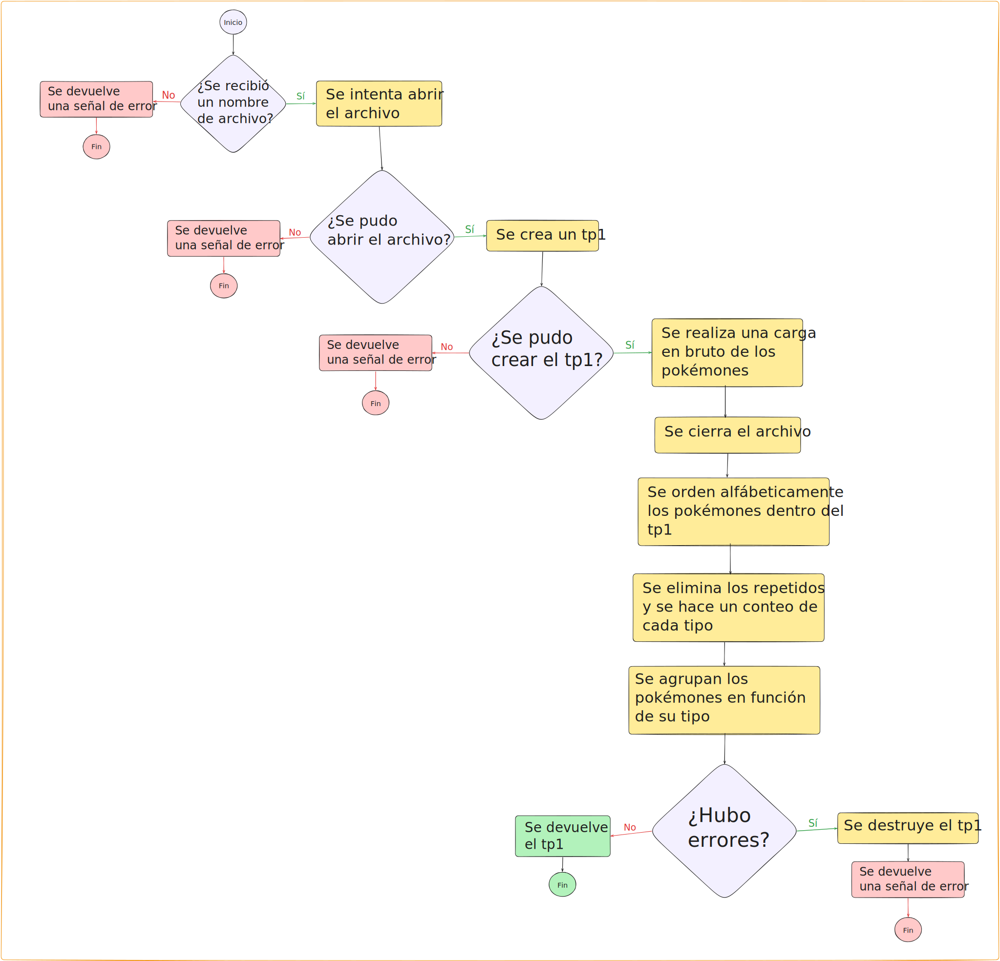
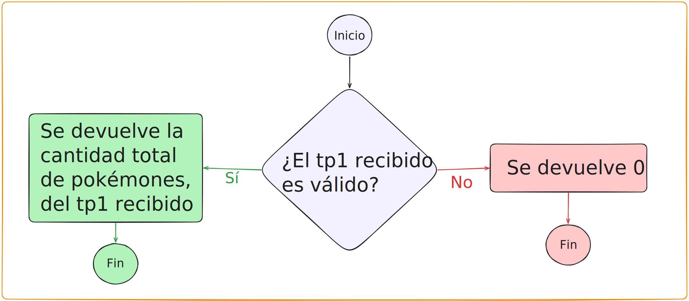
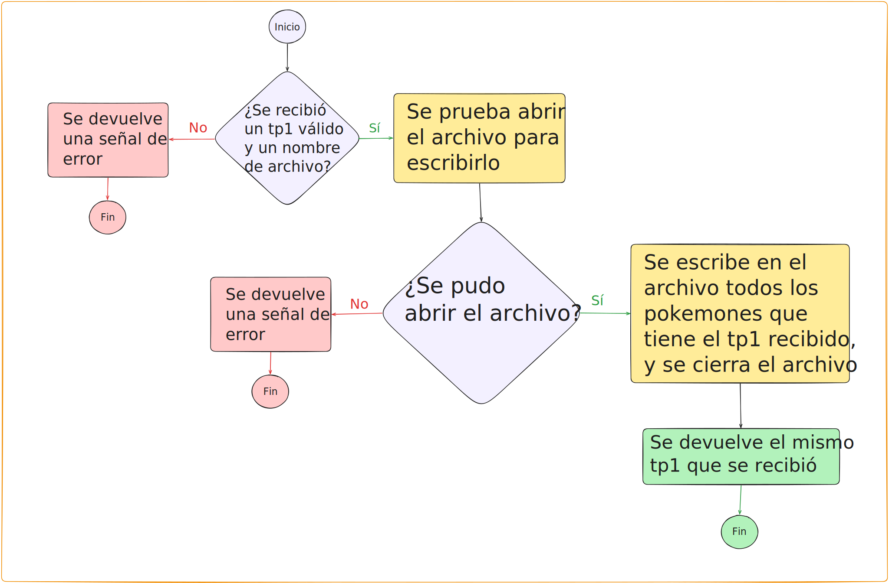
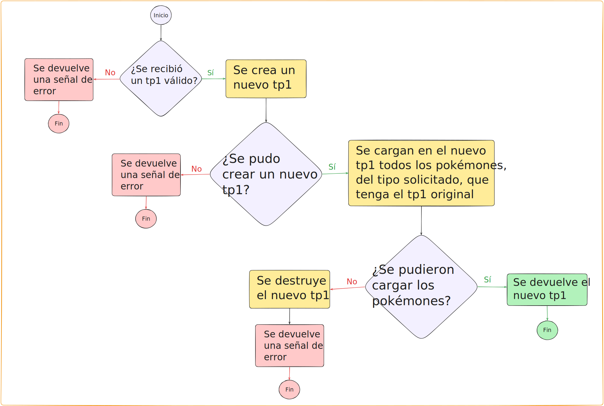
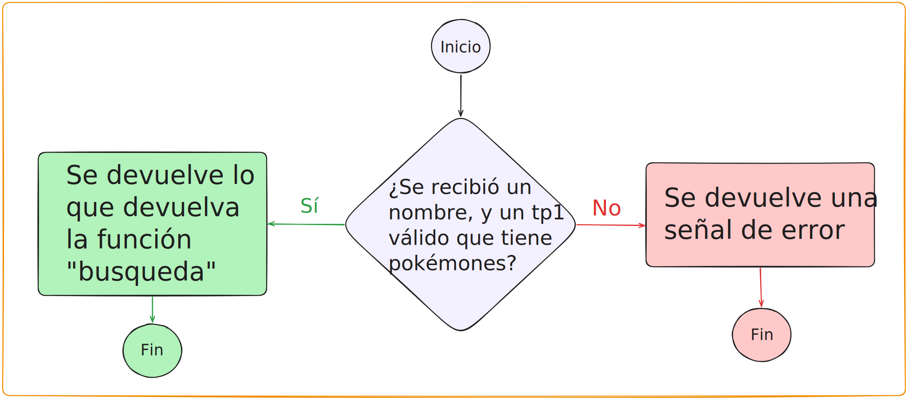
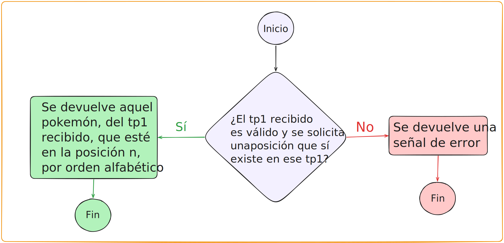
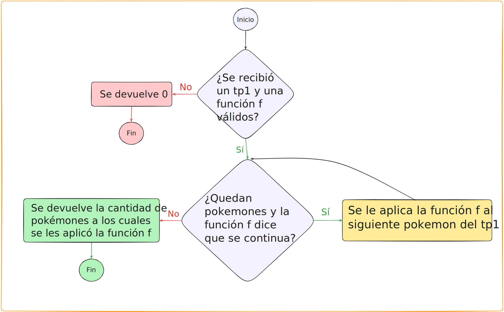
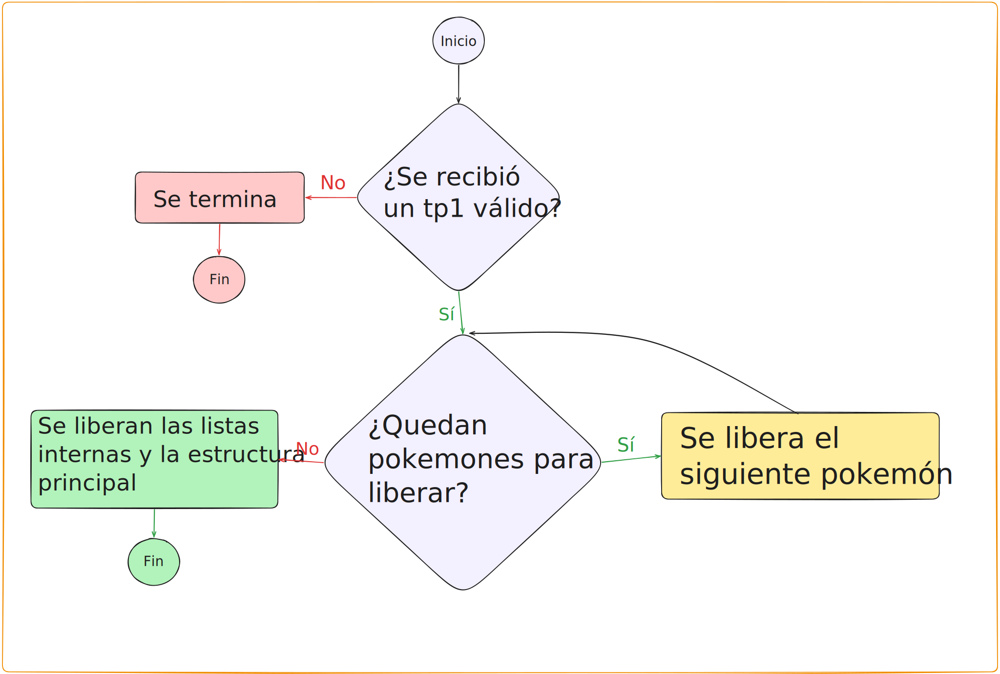
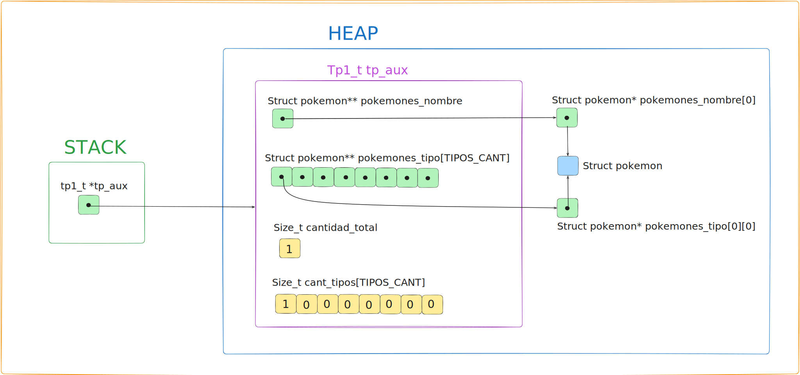

<div align="right">
    
</div>

# TP


## Información del estudiante

* Lautaro Jesús Duarte Vera
* 114088
* lautarojesussss@gmail.com

---

## Índice
* [1. Instrucciones](#1-Instrucciones)
  * [1.1. Compilar el proyecto](#11-Compilar-el-proyecto)
  * [1.2. Ejecutar las pruebas](#12-Ejecutar-las-pruebas)
  * [1.3. Ejecutar el programa con Valgrind](#13-Ejecutar-el-programa-con-Valgrind)
* [2. Funcionamiento](#2-Funcionamiento)
* [3. Estructura](#3-Estructura)
  * [3.1. Diagrama de memoria](#31-Diagrama-de-memoria)
  * [3.2. Análisis de complejidades](#32-Análisis-de-complejidades)
* [4. Decisiones de diseño y/o complejidades de implementación](#4-Decisiones-de-diseño-yo-complejidades-de-implementación)
* [5. Respuestas a las preguntas teóricas](#5-Respuestas-a-las-preguntas-teóricas)

## 1. Instrucciones

### 1.1. Compilar el proyecto
```bash
make
```

### 1.2. Ejecutar las pruebas
```bash
make run
```

### 1.3. Ejecutar las pruebas con Valgrind
```bash
make valgrind

```

### 1.4. Ejecutar main (mostrar nombre) con valgrind
```bash
make valgrind-main-mostrar-nombre

```

## 2. Funcionamiento

El Tipo de Dato Abstracto (TDA) `tp1_t` está diseñado para la gestión y consulta de registros de Pokémones. Tras la carga inicial de datos desde un archivo, el TDA expone las siguientes capacidades:

* **Búsqueda indexada:** Permite acceder a la información completa de un Pokémon específico mediante su nombre o su posición relativa en la colección (ordenada alfabéticamente).
* **Filtrado por atributos:** Posibilita la extracción de múltiples registros simultáneamente, según el tipo de pokemón solicitado.
* **Iteración interna:** Implementa un iterador (`tp1_con_cada_pokemon`) diseñado para aplicar funciones *callback* booleanas sobre los pokémones de la estructura.
* **Consulta de estado:** Provee primitivas para obtener la cantidad total de Pokémones almacenados en la estructura en todo momento.

<div align="center">
  
  <p><i>Diagrama de flujo de tp1_leer_archivo. Es importante recalcar que al agrupar los pokémones en función de su tipo no se pierde el orden alfabético para los mismos.</i></p>
</div>
<div align="center">
  
  <p><i>Diagrama de flujo tp1_cantidad.</i></p>
</div>
<div align="center">
  
  <p><i>Diagrama de flujo de tp1_guardar_archivo.</i></p>
</div>
<div align="center">
  
  <p><i>Diagrama de flujo de tp1_filtrar_tipo.</i></p>
</div>
<div align="center">
  
  <p><i>Diagrama de flujo de tp1_buscar_nombre.</i></p>
</div>
<div align="center">
  
  <p><i>Diagrama de flujo de tp1_buscar_orden.</i></p>
</div>
<div align="center">
  
  <p><i>Diagrama de flujo de tp1_con_cada_pokemon.</i></p>
</div>
<div align="center">
  
  <p><i>Diagrama de flujo de tp1_destruir.</i></p>
</div>


## 3. Estructura
### Arquitectura de la Estructura `tp1_t`

El Tipo de Dato Abstracto `tp1_t` está diseñado para gestionar la colección de Pokémones de manera eficiente, separando el almacenamiento de los datos de su organización lógica. La estructura se compone de los siguientes campos:

* **`pokemones_nombre`**: Un arreglo dinámico de punteros a `struct pokemon`, mediante el cual se mantiene a toda la colección ordenada alfabéticamente.
* **`pokemones_tipo`**: Un arreglo de arreglos de punteros (o matriz de referencias), donde cada sub-arreglo agrupa exclusivamente los punteros a los Pokémones correspondientes a un tipo específico de Pokémon.
* **Variables de estado (`cantidad_total` y `cant_tipos`)**: Son contadores que representan el tamaño (tope) del arreglo principal y de cada sub-arreglo por tipo, respectivamente.

#### Justificación de Diseño: Uso exclusivo de punteros
Se tomó la decisión de almacenar únicamente referencias de memoria (punteros) dentro de los arreglos de `tp1_t`, en lugar de alojar copias literales de los `struct pokemon`. Esto brinda dos ventajas fundamentales:

1. **Eficiencia temporal en el ordenamiento:** Durante la fase de carga, los datos se leen secuencialmente y luego deben ser reordenados alfabéticamente, por su nombre, y clasificados en función de su tipo. Realizar intercambios (*swaps*) utilizando únicamente punteros (cuyo tamaño es de 4 o 8 bytes como máximo, según el sistema operativo) requiere una fracción del tiempo de procesamiento en comparación con copiar y reescribir un `struct` completo de mayor tamaño.
2. **Optimización espacial e integridad de datos:** Al utilizar referencias, un mismo Pokémon puede coexistir simultáneamente en el arreglo ordenado alfabéticamente (`pokemones_nombre`) y en su respectiva categoría (`pokemones_tipo`) sin necesidad de duplicar la información del `struct` en la memoria *heap*.


### 3.1. Diagrama de memoria

<div align="center">
  
  <p><i>Diagrama de memoria del TDA tp1_t. Se representa aquí un escenario en el que solo se ha cargado al tp1_t un pokémon, de tipo ELEC. Aquellos punteros de los cuales no salen flechas deben ser interpretados como NULL.</i></p>
</div>


### 3.2. Análisis de complejidades temporales
Los siguientes analisis de complejidad temporal asintótica se realizan bajo la premisa de que el tamaño del problema, N ,representa siempre la cantidad de pokémones involucrados, ya sea en un archivo de entrada, dentro de la estructura `tp1_t`, o en un arreglo dinámico de punteros.

El analisis de la complejidad de la función `tp1_leer_archivo` se detalla fuera de la siguiente tabla, debido a que requiere un desglose mucho más exhaustivo en comparación con el resto de las funciones que se analizan en esta sección. 

| Función | Complejidad | Justificación |
| :--- | :---: | :--- |
| `tp1_cantidad` | $O(1)$ | La obtención de la cantidad total requiere únicamente acceder y retornar el valor almacenado en el campo `cantidad_total` de la estructura `tp1_t`. Al no requerir iteraciones ni depender del volumen de los datos, su complejidad temporal asintótica es estrictamente constante. |
| `tp1_buscar_orden` | $O(1)$ | La función realiza un acceso directo a memoria mediante el índice proporcionado sobre el arreglo principal (`pokemones_nombre`). Al operar con un arreglo continuo en memoria, el costo de acceso a cualquier posición es inmediato, resultando en una complejidad asintótica constante. |
| `tp1_destruir` | $O(N)$ | Se debe recorrer el arreglo principal liberando la memoria dinámica individual de cada uno de los $N$ Pokémones y de sus respectivos nombres, lo cual implica un esfuerzo de $O(N)$. Posteriormente, se liberan los arreglos auxiliares por tipo; al ser una cantidad fija de 8 iteraciones (`CANT_TIPOS`), representa un esfuerzo de $O(1)$. Por suma asintótica, el esfuerzo lineal domina, resultando en $O(N)$. |
| `tp1_con_cada_pokemon`| $O(N \cdot O(f))$ | Se realiza una iteración secuencial sobre el arreglo principal. En el peor de los casos (cuando la función no interrumpe el ciclo prematuramente), se ejecutan $N$ iteraciones. Dado que en cada ciclo se invoca a la función *callback* `f`, el costo total es el producto de $N$ por la complejidad asintótica de dicha función, la cual es desconocida. |
| `tp1_guardar_archivo` | $O(N)$ | Se recorren secuencialmente todos los Pokémones de la estructura (mediante su arreglo principal), aplicando a cada uno una función de escritura en disco. Formatear y escribir un registro requiere un esfuerzo constante de $O(1)$. Al repetirse este proceso sobre los $N$ elementos, la complejidad temporal asintótica general es lineal. |
| `tp1_buscar_nombre` | $O(\log N)$ | La búsqueda se implementa mediante el algoritmo de Búsqueda Binaria (*divide y vencerás*), aprovechando que el arreglo base se encuentra ordenado. Analizado bajo el Teorema Maestro, la función posee un factor de reducción $b=2$, un factor de ramificación $a=1$, y un esfuerzo no recursivo constante $f(N) \in O(1)$. Al enmarcarse en el Caso 2 del teorema, la cantidad de niveles del árbol de recursión determina una complejidad temporal asintótica de orden logarítmico. |
| `tp1_filtrar_tipo` | $O(N)$ | La función itera sobre el sub-arreglo correspondiente al tipo solicitado para efectuar copias. En el peor de los casos (donde absolutamente todos los Pokémones de la colección pertenecen al mismo tipo), dicho sub-arreglo contiene exactamente $N$ elementos. Como realizar las copias y asignaciones implica operaciones de costo $\mathcal{O}(1)$ por elemento, el esfuerzo total está acotado linealmente. |


#### Analisis de la complejidad de `tp1_leer_archivo`:
  Esta es la función más compleja y larga de las que se pedía implementar, por eso hago el analisis por separado, fuera de la tabla. En el peor de los casos se realizan 4 llamadas a funciones auxiliares de complejidad temporal asintótica no constante, estas son `cargar_en_bruto`, `ordenar_alfabeticamente`, `limpiar_y_contar`, y `clasificar_por_tipo`.
Prosigo con el analisis de cada una para determinar la complejidad total de la función. 

#### Análisis de la complejidad de `cargar_en_bruto`:

La función ejecuta un ciclo `while` que itera $N$ veces (una vez por cada línea/Pokémon leída del archivo). En cada iteración, insertar un elemento en un arreglo, lo que implica $1$ operación. Sin embargo, cuando la capacidad del arreglo se llena, la función `agregar_pokemon` realiza un `realloc` duplicando el tamaño del buffer y copiando los elementos existentes.

Dado que las redimensiones del arreglo ocurren en potencias de 2 ($2, 4, 8, 16...$), la cantidad total de redimensiones para $N$ pokémones es $\log_2 N$. 

Aplicando el análisis de la complejidad amortizada, el costo total de todas las copias de memoria en está dado por la siguiente sumatoria:

$$\Large \text{Costo de Copias} = \sum_{i=1}^{\log_2 N} 2^i$$

Por la propiedad matemática de la suma de potencias de 2, sabemos que $\Large \sum_{i=1}^{k} 2^i = 2^{k+1} - 2$. Reemplazando obtenemos:

$$\Large \text{Costo de Copias} = 2^{(\log_2 N) + 1} - 2$$

Aplicando la propiedades de exponentes pasamos a tener ($x^{a+1} = x \cdot x^a$):

$$\Large \text{Costo de Copias} = 2 \cdot 2^{\log_2 N} - 2$$

Y por propiedades de logaritmos, sabemos que $2^{\log_2 N} = N$. Por lo tanto, la expresión queda como:

$$\Large \text{Costo de Copias} = 2N - 2$$

Para obtener el esfuerzo exacto $f(N)$ en el peor de los casos, sumamos el costo de las inserciones individuales ($N$) al costo total de las copias que acabamos de calcular y al costo de leer y parsear las lineas

$$\Large f(N) = N + (2N - 2) +2N = 5N - 2$$

Por las propiedades del análisis asintótico, sabemos que los coeficientes y los términos de menor grado no afectan la tasa de crecimiento cuando $N$ tiende a infinito. Por lo tanto, podemos afirmar que la función tiene una complejidad temporal asintótica lineal.

#### Analisis de la función `ordenar_alfabeticamente`:

La función `ordenar_alfabeticamente` actúa como punto de entrada para `merge_sort_alfabetico`, el cual implementa un algoritmo del tipo *divide y vencerás*. 

Podemos modelar su complejidad temporal $T(N)$ para un arreglo de $N$ Pokémones mediante la siguiente relación de recurrencia:

$$\Large T(N) = 2T(N/2) + O(N)$$ 

Donde:
* El término $2T(N/2)$ representa las dos llamadas recursivas, cada una procesando la mitad del arreglo.
* El término $O(N)$ representa el costo lineal de la función `merge_alfabetico`, la cual recorre y mezcla las dos mitades en un arreglo ordenado auxiliar.

Para resolver esta recurrencia, aplicamos el **Teorema Maestro**, cuya forma general es:

$$\Large T(N) = aT(N/b) + f(N)$$

Extrayendo las constantes de nuestra función, obtenemos:
* $a = 2$ (factor de ramificación)
* $b = 2$ (factor de reducción)
* $f(N) = O(N)$ (esfuerzo de mezcla)

Para determinar en qué caso del teorema nos encontramos, calculamos el polinomio crítico $N^{\log_b a}$ que representa la cantida de hojas del árbol:

$$\Large N^{\log_2 2} = N^1 = N$$

Al comparar el esfuerzo de mezcla $f(N)$ con el polinomio crítico que representa la cantidad de hojas, observamos que crecen asintóticamente a la misma velocidad (es decir, $f(N)$ es proporcional a $N^{\log_b a}$). Esto significa que estamos en el **Caso 2** del Teorema Maestro.

La resolución para el Caso 2 dicta que la complejidad temporal final se obtiene multiplicando el polinomio crítico (o el esfuerzo de mezcla, porque son equivalentes) por un factor logarítmico:

$$\Large T(N) = O(N^{\log_b a} \log_2 N)$$

Sustituyendo en nuestros valores:

$$\Large T(N) = O(N \log_2 N)$$

Aplicando el Teorema Maestro, se demostró que la complejidad temporal asintótica de `ordenar_alfabeticamente` en el peor de los casos pertenece a **$O(N \log N)$**.

#### Análisis de la función `limpiar_y_contar`

La función `limpiar_y_contar` tiene como objetivo eliminar los Pokémones duplicados y contar la distribución por tipos. Su algoritmo utiliza una técnica de "dos punteros" (`i` y `j`) para recorrer y modificar el arreglo sin utilizar arreglos auxiliares.

Para un arreglo de $N$ Pokémones, podemos dividir el análisis en dos etapas:

1. **Recorrido y limpieza:** El ciclo `while` itera a lo sumo $N$ veces. En cada iteración, realiza operaciones de reasignación de punteros, incrementos aritméticos y libera memoria (`free`), las cuales son todas $\mathcal{O}(1)$. Además, ejecuta `strcasecmp` para comparar nombres. Dado que la longitud máxima de un nombre es una constante acotada ($L$), la comparación se considera $\mathcal{O}(1)$. El costo total de este ciclo es $\mathcal{O}(N)$.
2. **Ajuste de memoria:** Al finalizar, se llama a `ajustar_buffer` (que ejecuta un `realloc`) para encoger el arreglo y liberar la memoria sobrante. En el peor de los casos, si no hubo duplicados, se copian $N$ punteros, lo que implica un esfuerzo de $\mathcal{O}(N)$.

Aplicando la regla de la suma para bloques secuenciales, la función de costo asintótico resulta:

$$\Large T(N) = \mathcal{O}(N) + \mathcal{O}(N) \in \mathcal{O}(N)$$

**Conclusión:** La complejidad temporal asintótica de `limpiar_y_contar` es estrictamente **$\mathcal{O}(N)$**.

---

#### Análisis de la función `clasificar_por_tipo`

La función `clasificar_por_tipo` distribuye los punteros de los Pokémones ya procesados en 8 arreglos secundarios según su tipo.

El algoritmo consta de dos bloques secuenciales:

1. **Reserva de Memoria:** Un bucle `for` inicial reserva la memoria exacta necesaria para cada arreglo de tipos. Como la cantidad de tipos es constante (`CANT_TIPOS = 8`) y los tamaños exactos ya fueron calculados en la función `limpiar_y_contar` (evitando tener que redimensionar los arreglos dinámicamente), este ciclo se ejecuta en tiempo constante $\mathcal{O}(1)$.
2. **Distribución de Punteros:** El segundo ciclo `for` itera exactamente $N$ veces (donde $N$ es la cantidad de Pokémones únicos restantes). En cada iteración, realiza lecturas y asignaciones de punteros mediante índices en los diferentes arreglos. El acceso directo a un arreglo en memoria tiene costo $\mathcal{O}(1)$. El esfuerzo total de este ciclo es $\mathcal{O}(N)$.

Planteando la suma de complejidades secuenciales, el término constante es absorbido por el término lineal:

$$\Large T(N) = \mathcal{O}(1) + \mathcal{O}(N) \in \mathcal{O}(N)$$

**Conclusión:** Gracias a la pre-asignación de memoria exacta, la complejidad temporal asintótica de `clasificar_por_tipo` es **$\mathcal{O}(N)$**.
 
#### Conclusión final
Dado que estas funciones se ejecutan de manera estrictamente secuencial una tras otra, el esfuerzo temporal total $T(N)$ de `tp1_leer_archivo` se representa como la suma de los esfuerzos asintóticos de sus componentes:

$$\Large T(N) = O(N) + O(N \log N) + O(N) + O(N)$$

Para simplificar esta expresión, aplicamos la Regla del Término Dominante del análisis asintótico, la cual establece que la suma de varias complejidades temporales pertenece al orden de la función con mayor tasa de crecimiento. Al comparar nuestras cotas, sabemos que el crecimiento lineal-logarítmico domina de forma estricta al crecimiento lineal cuando $N$ tiende a infinito ($N \log N > N$). Por lo tanto, los términos lineales de `cargar_en_bruto`, `limpiar_y_contar` y `clasificar_por_tipo` son absorbidos por el término dominante del ordenamiento:

$$\Large T(N) \in O(N \log N)$$

**Conclusión:** La complejidad temporal asintótica total de la función `tp1_leer_archivo` está dictada por su operación más costosa, resultando en un tiempo de ejecución de **$O(N \log N)$**.


## 4. Decisiones de diseño y/o complejidades de implementación

### Concentración del flujo en `tp1_leer_archivo`
Se estableció que el núcleo del procesamiento masivo ocurra dentro de la función `tp1_leer_archivo`. Esta función actúa como el orquestador principal del TDA, con una complejidad temporal asintótica total de **$O(N \log N)$** (la de mayor orden entre las funciones que se pedía implementar). Su diseño centraliza y secuencia el flujo de trabajo: lee el archivo dinámicamente, valida los formatos, instancia los registros (`struct pokemon`), los ordena alfabéticamente, depura los duplicados, calcula los totales de cada tipo y, finalmente, clasifica los punteros según su tipo elemental.

### Implementación con complejidad amortizada
Para mitigar el costo temporal de las reasignaciones de memoria dinámica, se implementó una estrategia de expansión geométrica (duplicación de capacidad) que garantiza una complejidad amortizada lineal. Esta decisión se aplicó en dos instancias:

1. **En el arreglo de Pokémones (`agregar_pokemon`):** Evita que la función principal recaiga en una complejidad asintótica $O(N^2)$ generada por el sobrecosto de realizar un `realloc` por cada nueva línea parseada.
2. **En la lectura del archivo (`leer_linea`):** Aunque el esfuerzo de esta función se considera constante respecto a la cantidad total de líneas ($N$), su costo real depende estrictamente de la longitud de la cadena leída ($L$). El enunciado del trabajo práctico impone la siguiente restricción:
> *"Tampoco se permite presuponer una longitud máxima de línea, nombres, vectores, etc. Debe utilizarse memoria dinámica."*

Al estar formalmente prohibido asumir un tope máximo para $L$ (lo que hubiese permitido abstraerlo como una constante $O(1)$), el uso de memoria dinámica con expansión geométrica previene que el costo temporal de leer una sola línea degrade a un escenario cuadrático $O(L^2)$ respecto a su longitud.

### Optimización en la función `split`
Para el parseo de las cadenas, se optó por evitar redimensiones incrementales (`reallocs` sucesivos) durante el ciclo principal. En su lugar, se determina inicialmente el tamaño del arreglo de punteros asumiendo el límite superior teórico (el peor de los casos: que la cadena esté compuesta enteramente por caracteres separadores). Cualquier implementación funcional de `split` requiere forzosamente evaluar cada carácter del texto original para identificar los cortes, lo que impone un piso ineludible de complejidad temporal lineal $\mathcal{O}(L)$. Por ende, realizar una iteración adicional al comienzo para conocer la longitud de la cadena y pre-asignar la memoria representa un esfuerzo secuencial de $\mathcal{O}(L) + \mathcal{O}(L)$, lo cual, por propiedades del análisis asintótico, no altera el orden de complejidad final del algoritmo.

 Este enfoque simplifica notablemente la lógica y minimiza la interacción con el *heap*, requiriendo un único `realloc` al finalizar para encoger y ajustar el *buffer* a la memoria estrictamente utilizada, aunque por supuesto esto tiene un mayor "desperdicio temporal" de memoria durante la ejecución de la función, en comparación con una implementación de la complejidad amortizada que duplique el tamaño del buffer solo al llenarlo, lo que imposibilita que en cualquier momento de la función se esté ocupando menos del 50% de la memoria reservada.

### Uso de búsqueda binaria para `tp1_buscar_nombre`
Se implementó el algoritmo de Búsqueda Binaria (*divide y vencerás*) para optimizar las consultas por nombre. Al aprovechar la precondición de que el arreglo base ya fue ordenado alfabéticamente durante la carga en `tp1_leer_archivo`, se logró reducir la complejidad temporal asintótica de las búsquedas de un esfuerzo lineal $\mathcal{O}(N)$ a un esfuerzo logarítmico $\mathcal{O}(\log N)$.

### Modularización mediante `utils.h`
Se decidió desacoplar ciertas funciones utilitarias (como el parseo numérico, la división de cadenas y la escritura de archivos) moviéndolas a un archivo `utils.h`. Esto responde al principio de cohesión: dichas funciones no están estrictamente vinculadas al estado interno del TDA `tp1_t` y, adicionalmente, son requeridas por el archivo `main.c` para operar independientemente.

### Modularización de constantes
Atendiendo a las correcciones recibidas en la entrega anterior (TP0), se implementó un archivo de cabecera `constantes.h` destinado a centralizar todas las constantes simbólicas (directivas `#define`) del proyecto. Se incluyeron comentarios aclaratorios indicando qué módulos consumen cada conjunto de constantes.

### Elección del Algoritmo de Ordenamiento (Merge Sort)
Para la implementación de la función `ordenar_alfabeticamente` se desestimó el uso de algoritmos elementales (como *Bubble Sort* o *Selection Sort*) y se optó por desarrollar un *Merge Sort*. Esta decisión se fundamenta en dos características críticas del algoritmo:

1. **Eficiencia asintótica:** Frente a la complejidad temporal cuadrática de $O(N^2)$ de los métodos elementales, Merge Sort garantiza un rendimiento de $O(N \log N)$ en el peor de los casos.
2. **Estabilidad del ordenamiento:** Merge Sort es un algoritmo estable, lo que implica que preserva estrictamente el orden relativo original de aquellos elementos que resultan iguales bajo el criterio de comparación (Pokémones homónimos). Esta propiedad es vital para la integridad del procesamiento posterior: al garantizar que los Pokémones repetidos queden agrupados de forma adyacente y respetando su orden de lectura original, la función `limpiar_y_contar` puede limitar su lógica a iterar secuencialmente, conservando únicamente la primera aparición y descartando las siguientes con una eficiencia de $O(N)$, sin requerir estructuras auxiliares para identificar cuál fue el registro original.

### Dificultades durante la implementación

La mayor dificultad que se halló durante la implementación se basa en la lectura y parseo de las lineas del archivo en la función `tp1_leer_archivo`. El proceso se hubiese simplificado si se pudiese establecer un máximo teórico en la cantidad de caracteres que pueda tener el nombre de un pokémon, para ser considerado válido.

### Dificultades en el diseño de pruebas del TDA

El desarrollo de las pruebas unitarias se llevó a cabo en una etapa tardía de la construcción del TDA. Esta decisión introdujo un sesgo de implementación involuntario que condicionó tanto la cobertura como la calidad de los casos de prueba en `pruebas_alumno.c`. 

Asimismo, la interfaz reducida expuesta por el tipo `tp1_t` dificultó el diseño de pruebas de **caja negra** estrictas y el aislamiento efectivo de cada funcionalidad. Dado que la única vía disponible para cargar la estructura sin violar el encapsulamiento es a través de `tp1_leer_archivo` —la primitiva de mayor complejidad lógica—, el testeo del resto de las operaciones quedó fuertemente acoplado al correcto funcionamiento de esta.

Esta dependencia estructural podría haberse mitigado ampliando la interfaz del TDA con una primitiva de inserción directa (por ejemplo, permitiendo cargar un `struct pokemon` instanciado en memoria). Esto hubiera facilitado la creación de escenarios de prueba controlados, desacoplando la validación de las operaciones de búsqueda y filtrado de la lógica entera de parseo de archivos.

### Detalles del diseño

Se optó por permitir la carga de pokémones con métricas negativas (velocidad, defensa, ataque). Dado que en struct pokemon (definido en tp1.h) estos campos son de tipo int y no size_t, no es posible alterar la estructura original y se asume que la admisión de valores negativos es un comportamiento intencional del diseño provisto por la cátedra.
 
## 5. Respuestas a las preguntas teóricas

### Consigna 1
> *"Explicar la elección de la estructura para implementar la funcionalidad pedida. Justifique el uso de cada uno de los campos de la estructura."*

📌 **Respuesta:** Esta justificación se encuentra desarrollada en detalle en la [sección 3, Estructura](#3-estructura).

---

### Consigna 2
> *"Dar una definición de complejidad computacional y explique cómo se calcula."*

#### Complejidad Computacional

En las ciencias de la computación, el término "complejidad computacional" posee una doble acepción dependiendo del contexto en el que se utilice:

* **Como campo de estudio:** Hace referencia a la *Teoría de la Complejidad Computacional*, una rama de la ciencia de la computación dedicada a entender y clasificar el "costo" intrínseco de los algoritmos y los límites teóricos de procesamiento.
* **Como propiedad de los algoritmos:** Se refiere a la característica estructural, inmutable y puramente matemática de un algoritmo específico, la cual es completamente independiente del hardware físico o del lenguaje de programación utilizado.

**Definición:**
La complejidad computacional (entendida como propiedad) expresa la cantidad de recursos que un algoritmo demanda para su ejecución en función del tamaño de la entrada de datos (denotado como $N$). Los dos recursos principales (pero no los únicos) que se analizan son el **tiempo de ejecución** (complejidad temporal, medida en operaciones elementales) y la **memoria utilizada** (complejidad espacial, medida en espacio de almacenamiento auxiliar). El objetivo es establecer el comportamiento teórico del algoritmo a medida que $N$ tiende al infinito (comportamiento asintótico). 

En la materia, de momento, solo se ha abordado la complejidad temporal, pero el método utilizado para analizar ambos tipos de complejidades es, a grandes rasgos, el mismo.

**Método de Cálculo:**
El cálculo se realiza mediante el análisis asintótico, y se expresa a través de la notación Big-O ($O$). Para determinar la complejidad de un algoritmo, se sigue un procedimiento de abstracción:

1. **Se identifica el tamaño del problema:** Se define qué variable específica representa el volumen de datos a procesar ($N$).
2. **Conteo de operaciones:** Se contabilizan las operaciones primitivas (asignaciones, comparaciones, saltos, operaciones aritméticas) que se ejecutan, asumiendo siempre el peor de los casos posibles.
3. **Identificación del término dominante:** Se formula una función matemática $f(N)$ que describe el costo total del algoritmo. De esta función, se aísla exclusivamente el término de mayor orden de crecimiento, ya que es el único que impacta de forma significativa cuando $N$ tiende a infinito.
4. **Eliminación de constantes:** Se descartan los coeficientes y las constantes aditivas, dado que la notación busca clasificar la "tasa de crecimiento" y no el costo exacto en operaciones elementales. Por ejemplo, una función de complejidad temporal $f(N) = 3N^2 + 5N + 10$ se reduce y clasifica algebraicamente bajo la complejidad asintótica $O(N^2)$.

---

### Consigna 3
> *"Explicar con diagramas cómo quedan dispuestas las estructuras y elementos en memoria."*

📌 **Respuesta:** El diagrama de memoria y su explicación se encuentran en la [sección 3.1, Diagrama de memoria](#31-diagrama-de-memoria).

---

### Consigna 4
> *"Justificar la complejidad computacional temporal de cada una de las funciones que se piden implementar."*

📌 **Respuesta:** Las justificaciones y cálculos asintóticos se detallan en la [sección 3.2, Análisis de complejidades](#32-análisis-de-complejidades).

---

### Consigna 5
> *"Explique qué dificultades tuvo para implementar las funcionalidades pedidas en el main (si tuvo alguna) y explique si alguna de estas dificultades se podría haber evitado modificando la definición del .h"*

📌 **Respuesta:** Las decisiones tomadas respecto a las funcionalidades y la necesidad de modularizar ciertas operaciones en `utils.h` se responden en la [sección 4, Decisiones de diseño y/o complejidades de implementación](#4-decisiones-de-diseño-yo-complejidades-de-implementación).
