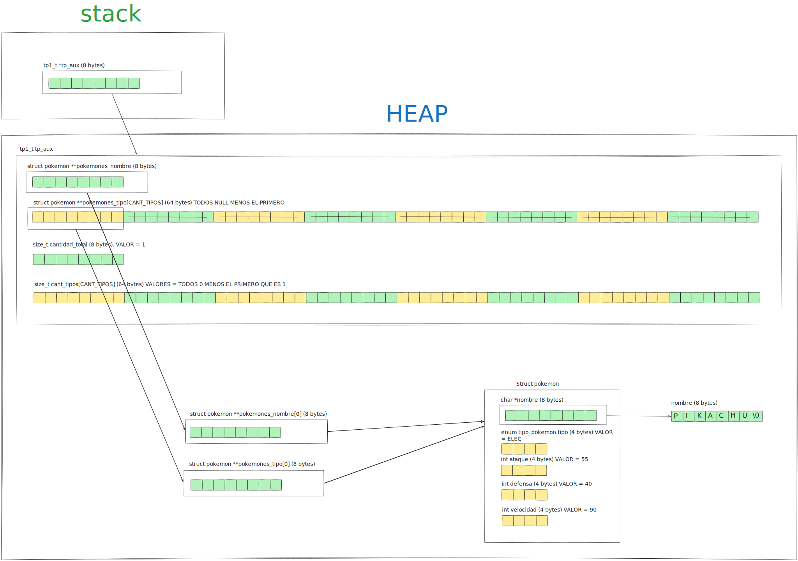

<div align="right">
    
</div>

# TP


## Información del estudiante

* Lautaro Jesús Duarte Vera
* 114088
* lautarojesussss@gmail.com

---

## Índice
* [1. Instrucciones](#1-Instrucciones)
  * [1.1. Compilar el proyecto](#11-Compilar-el-proyecto)
  * [1.2. Ejecutar las pruebas](#12-Ejecutar-las-pruebas)
  * [1.3. Ejecutar el programa con Valgrind](#13-Ejecutar-el-programa-con-Valgrind)
* [2. Funcionamiento](#2-Funcionamiento)
* [3. Estructura](#3-Estructura)
  * [3.1. Diagrama de memoria](#31-Diagrama-de-memoria)
  * [3.2. Análisis de complejidades](#32-Análisis-de-complejidades)
* [4. Decisiones de diseño y/o complejidades de implementación](#4-Decisiones-de-diseño-yo-complejidades-de-implementación)
* [5. Respuestas a las preguntas teóricas](#5-Respuestas-a-las-preguntas-teóricas)

## 1. Instrucciones

### 1.1. Compilar el proyecto
```bash
make
```

### 1.2. Ejecutar las pruebas
```bash
make run
```

### 1.3. Ejecutar el programa con Valgrind
```bash
make valgrind-main
```

## 2. Funcionamiento

El tp1_t y sus primitivas funciona para guardar y consultar información de diferentes pokemones, después de cargar un tp1 con pokemones de un archivo se puede consultar sobre un pokemon dando su nombre o su posición por orden alfabético, y también consultar por varios pokemones dando el tipo que se quiere obtener; se le puede aplicar cambios a los pokemones del tp1_t usando el iterador interno tp1_con_cada_pokemon, y se puede consultar la cantidad total de pokemones en un tp1.

<div align="center">
  
  <p>Diagrama de flujo de tp1_leer_archivo.</p>
</div>
<div align="center">
  
  <p>Diagrama de flujo tp1_cantidad.</p>
</div>
<div align="center">
  
  <p>Diagrama de flujo de tp1_guardar_archivo.</p>
</div>
<div align="center">
  
  <p>Diagrama de flujo de tp1_filtrar_tipo.</p>
</div>
<div align="center">
  
  <p>Diagrama de flujo de tp1_buscar_nombre.</p>
</div>
<div align="center">
  
  <p>Diagrama de flujo de tp1_buscar_orden.</p>
</div>
<div align="center">
  
  <p>Diagrama de flujo de tp1_con_cada_pokemon.</p>
</div>
<div align="center">
  
  <p>Diagrama de flujo de tp1_destruir.</p>
</div>


## 3. Estructura
Para el tp1_t decidí usar un vector de punteros a struct pokemon que los tenga ordenados por orden alfabético y un arreglo de arreglos de punteros que tengan cada uno solo a los punteros a pokemones de un tipo (ELEC, FUEG, NORM etc etc), y tengo los respectivos topes de todos los vectores.


### 3.1. Diagrama de memoria

<div align="center">
  
  <p>Diagrama de memoria de tp1_t.</p>
</div>


### 3.2. Análisis de complejidades

|      Función      |Complejidad|                 Justificación                  |
|:-----------------:|:---------:|:----------------------------------------------:|
| `tp1_cantidad`       |  $O(1)$   |Independientemente de la cantidad de punteros que tengan los arreglos del tp1_t sacar la cantidad total es simplemente consultar el campo size_t cantidad_total y nada más, es decir, es de complejidad asintotica constante.|
|      `tp1_buscar_orden`       |  $O(1)$   |No importa qué posición tenga el pokemon solicitado en todos los casos hago un acceso directo a esa posición y devuelvo el valor, no tengo que recorrer el arreglo, así que la complejidad asintotica es constante.|
|      `tp1_destruir`       |  $O(n)$ |La complejidad es lineal porque debo recorrer el arreglo que tiene a todos los pokemones e ir liberandolos (liberarlos son dos operaciones nomás), luego a parte libero los vectores exclusivos de cada tipo pero eso es constante porque son siempre 8 operaciones.|
| `tp1_guardar_archivo`       |  $O(n)$   |Es básicamente un caso de uso para el iterador interno, que es lineal, y la función que aplico es solamente una para escribir un pokemón, por lo tanto no hay bucles ni iteraciones, en todo caso esa función de escribir_pokemon depende del largo del nombre del pokemon. Si asumo n como la cantidad de pokemones del tp1_t tp1_guardar_archivo es de complejidad asintotica lineal.|
| `tp1_buscar_nombre`       |  $O(log(n))$   |El algortimo que uso para encontrar el pokemon solicitado dentro del vector de pokemones_nombre es la busqueda binaria, es un algortimo de divide y vencerás al que se le puede aplicar el teorema maestro, la parte función tiene una sola llamada recursiva así que las llamadas no crecen a medida que se avanza en los niveles del árbol de llamadas, es decir, el factor de ramificación es 1, y la parte no recursiva es constante, así que en todos los niveles el trabajo no solo es igual sino que es de complejidad asintotica constante, y la complejidad asintotica de la función en general se puede calcular con la cantidad de niveles, y que se calculan con el log en base b de n, siendo b el factor de reducción y n el tamaño del problema.|
| `tp1_filtrar_tipo`       |  $O(n)$   |En esta función básicamente lo que hago son copias de los pokemones del arreglo exclusivo del tipo solicitado, que siempre es menor o igual al arreglo que contiene a todos los pokemones, si asumimos que n es la cantidad total de pokemones del tp1_t entonces en el peor de los casos (que justo todos los pokemones del tp1_t sean del tipo solicitado) la complejidad es 2n o sea la complejidad asintotica es O(n).|
| `tp1_con_cada_pokemon`       |  $O(n)$   |Hago una iteración sobre el arreglo pokemones_nombre que tiene todos los pokemones, así que en el peor de los casos es justo n la cantidad de operaciones y eso se multiplica por la complejidad de f, que no conozco, por ende O(n.O(f)).|

#### Analisis de la complejidad de `tp1_leer_archivo`:
  Esta es la función más compleja de las que se pedía implementar, por eso hago el analisis por separado. En el peor de los casos realizo 4 llamadas a funciones auxiliares de complejidad asintotica no constante, estas son `cargar_en_bruto`, `ordenar_alfabeticamente`, `limpiar_y_contar`, y `clasificar_por_tipo`.
Prosigo con el analisis de cada una para determinar la complejidad total de la función. 

##### Analis de la complejidad de `cargar_en_bruto`:

La función ejecuta un ciclo `while` que itera $N$ veces (una vez por cada línea/Pokémon leída del archivo). En cada iteración, insertar un elemento en un arreglo, lo que implica $1$ operación. Sin embargo, cuando la capacidad del arreglo se llena, la función `agregar_pokemon` realiza un `realloc` duplicando el tamaño del buffer y copiando los elementos existentes.

Dado que las redimensiones del arreglo ocurren en potencias de 2 ($2, 4, 8, 16...$), la cantidad total de redimensiones para $N$ pokemones es $\log_2 N$. 

Aplicando el análisis de la complejidad amortizada, el costo total de todas las copias de memoria en está dado por la siguiente sumatoria:

$$\Large \text{Costo de Copias} = \sum_{i=1}^{\log_2 N} 2^i$$

Por la propiedad matemática de la suma de potencias de 2, sabemos que $\Large \sum_{i=1}^{k} 2^i = 2^{k+1} - 2$. Reemplazando obtenemos:

$$\Large \text{Costo de Copias} = 2^{(\log_2 N) + 1} - 2$$

Aplicando la propiedades de exponentes pasamos a tener ($x^{a+1} = x \cdot x^a$):

$$\Large \text{Costo de Copias} = 2 \cdot 2^{\log_2 N} - 2$$

Y por propiedades de logaritmos, sabemos que $2^{\log_2 N} = N$. Por lo tanto, la expresión queda como:

$$\Large \text{Costo de Copias} = 2N - 2$$

Para obtener el esfuerzo exacto $f(N)$ en el peor de los casos, sumamos el costo de las inserciones individuales ($N$) al costo total de las copias que acabamos de calcular y al costo de leer y parsear las lineas

$$\Large f(N) = N + (2N - 2) +2N = 5N - 2$$

Por las propiedades del análisis asintótico, sabemos que los coeficientes y los términos de menor grado no afectan la tasa de crecimiento cuando $N$ tiende a infinito. Por lo tanto, podemos afirmar que la función tiene una complejidad asintotica lineal.

##### Analisis de la función `ordenar_alfabeticamente`:

La función `ordenar_alfabeticamente` actúa como punto de entrada para `merge_sort_alfabetico`, el cual implementa un algoritmo del tipo *divide y vencerás*. 

Podemos modelar su complejidad $T(N)$ para un vector de $N$ Pokémones mediante la siguiente relación de recurrencia:

$$\Large T(N) = 2T(N/2) + O(N)$$ 

Donde:
* El término $2T(N/2)$ representa las dos llamadas recursivas, cada una procesando la mitad del arreglo.
* El término $O(N)$ representa el costo lineal de la función `merge_alfabetico`, la cual recorre y mezcla las dos mitades en un arreglo ordenado auxiliar.

Para resolver esta recurrencia, aplicamos el **Teorema Maestro**, cuya forma general es:

$$\Large T(N) = aT(N/b) + f(N)$$

Extrayendo las constantes de nuestra función, obtenemos:
* $a = 2$ (factor de ramificación)
* $b = 2$ (factor de reducción)
* $f(N) = O(N)$ (esfuerzo de mezcla)

Para determinar en qué caso del teorema nos encontramos, calculamos el polinomio crítico $N^{\log_b a}$ que representa la cantida de hojas del árbol:

$$\Large N^{\log_2 2} = N^1 = N$$

Al comparar el esfuerzo de mezcla $f(N)$ con el polinomio crítico que representa la cantidad de hojas, observamos que crecen asintóticamente a la misma velocidad (es decir, $f(N)$ es proporcional a $N^{\log_b a}$). Esto significa que estamos en el **Caso 2** del Teorema Maestro.

La resolución para el Caso 2 dicta que la complejidad final se obtiene multiplicando el polinomio crítico (o el esfuerzo de mezcla, porque son equivalentes) por un factor logarítmico:

$$\Large T(N) = O(N^{\log_b a} \log_2 N)$$

Sustituyendo en nuestros valores:

$$\Large T(N) = O(N \log_2 N)$$

Aplicando el Teorema Maestro, se demostró que la complejidad temporal asintótica de `ordenar_alfabeticamente` en el peor de los casos pertenece a **$O(N \log N)$**.

##### Analisis de la función `limpiar_y_contar`:
En esta función lo único que hago que involucra a la cantidad de pokemones es recorrer el arreglo que los contiene, 1 sola vez, dentro de ese for no llamo a otra función auxiliar propia ni hago nada de no sea constante en relación a la cantidad de los pokemones del arreglo, por lo tanto la complejidad asíntotica de la función es lineal.


##### Analisis de la función `clasificar_por_tipo`:
En esta función lo único que hago que depende de la cantidad de pokemones, es decir, de n, es recorrer una sola vez el arreglo de pokemones para poner sus punteros en los vectores exclusivos por tipo al que pertenecen, la cantidad que reservó para cada vector exclusivo por tipo es exacta porque ya los conté en la función `limpiar_y_contar`, por ende no hay necesidad de reallocs, la complejidad asintotica de esta función es lineal.
 
#### Conclusiones
Dado que estas funciones se ejecutan de manera estrictamente secuencial una tras otra, el esfuerzo temporal total $T(N)$ de `tp1_leer_archivo` se representa como la suma de los esfuerzos asintóticos de sus componentes:

$$T(N) = O(N) + O(N \log N) + O(N) + O(N)$$

Para simplificar esta expresión, aplicamos la Regla del Término Dominante del análisis asintótico, la cual establece que la suma de varias complejidades pertenece al orden de la función con mayor tasa de crecimiento. Formalmente:

$$O(f(N)) + O(g(N)) \in O(\max(f(N), g(N)))$$

Al comparar nuestras cotas, sabemos que el crecimiento lineal-logarítmico domina de forma estricta al crecimiento lineal cuando $N$ tiende a infinito ($N \log N > N$). Por lo tanto, los términos lineales de `cargar_en_bruto`, `limpiar_y_contar` y `clasificar_por_tipo` son absorbidos por el término dominante del ordenamiento:

$$T(N) \in O(N \log N)$$

**Conclusión:** La complejidad temporal asintótica total de la función `tp1_leer_archivo` está dictada por su operación más costosa, resultando en un tiempo de ejecución de **$O(N \log N)$**.


## 4. Decisiones de diseño y/o complejidades de implementación
Decidí que el grueso del trabajo ocurra en la función `tp1_leer_archivo`, que tiene complejidad asintotica $$O(n)$$, ahí me encargo de leer los archivos, validar las lineas, crear y cargar los struct pokemon, ordenarlos por orden alfabético, quitar los repetidos, contar los pokemones por tipo y finalmente ordenar a los pokemones por su tipo.

Para la carga en bruto de los punteros a los pokemones use complejidad amortizada, así evitaba que `tp1_leer_archivo` fuese $$O(n^2)$$ por los `reallocs`, y para el orden alfabético uso merge sort y `strcasecmp`; luego hago dos iteraciones distintas, una para quitar los pokemones repetidos del arreglo y contabilizar los únicos en función de su tipo, y otra para colocar copias de los punteros en los arreglos que están dedicados a un solo tipo de pokemones.

En la función `tp1_buscar_nombre` utilice busqueda binaria para hacer que la complejidad asintotica de la función no fuese lineal sino logaritmica, aprovechando que en `tp1_leer_archivo` ordenó alfabéticamente los pokemones.

Para `tp1_filtrar_tipo` aprovecho los arreglados exclusivos de cada tipo, y especificamente copio la info del vector exclusivo con el tipo solicitado del tp1 fuente hacia el vector pokemones_nombre y también el vector exclusivo del tipo solicitado del tp1 destino, cambió cantidad_total y el elemento que representa la cantidad del tipo solicitado en el tp1 destino.

## 5. Respuestas a las preguntas teóricas
Deberás incluir en esta sección las respuestas a las preguntas teóricas indicadas en el [enunciado](./ENUNCIADO.md) del TP.

## 5. Respuestas a las preguntas teóricas (EJEMPLO)

### 5.1. ¿Porqué...?
Respondido en su respectiva sección.

### 5.2 ¿Cómo...?
Para implementar el....

### 5.3 ¿Cuál fue el...?
El motivo fue....
