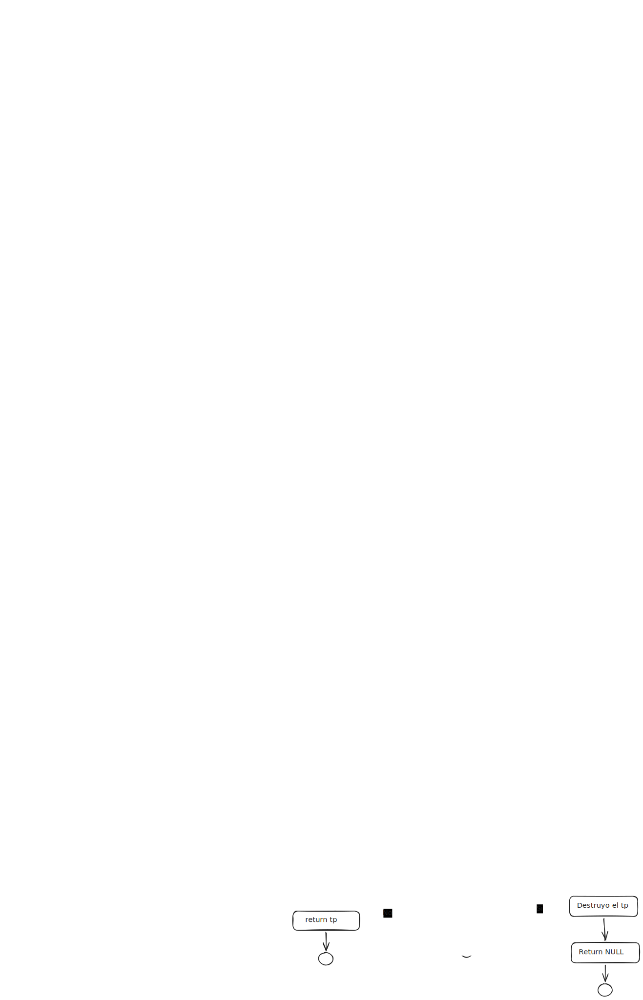
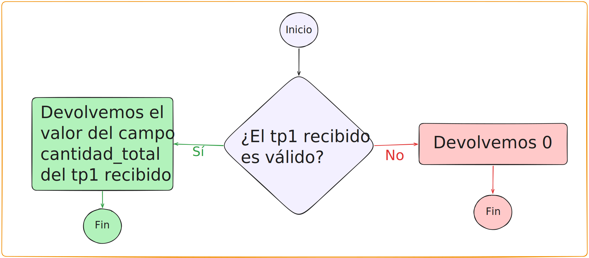
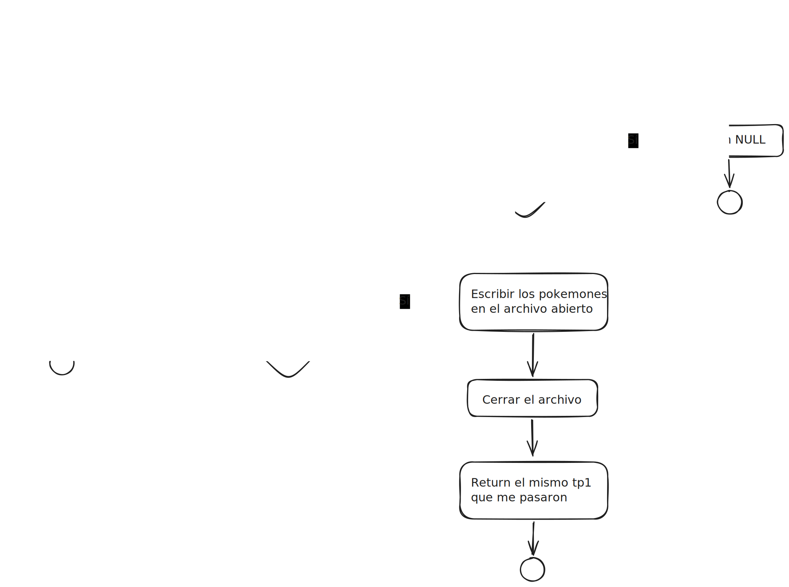
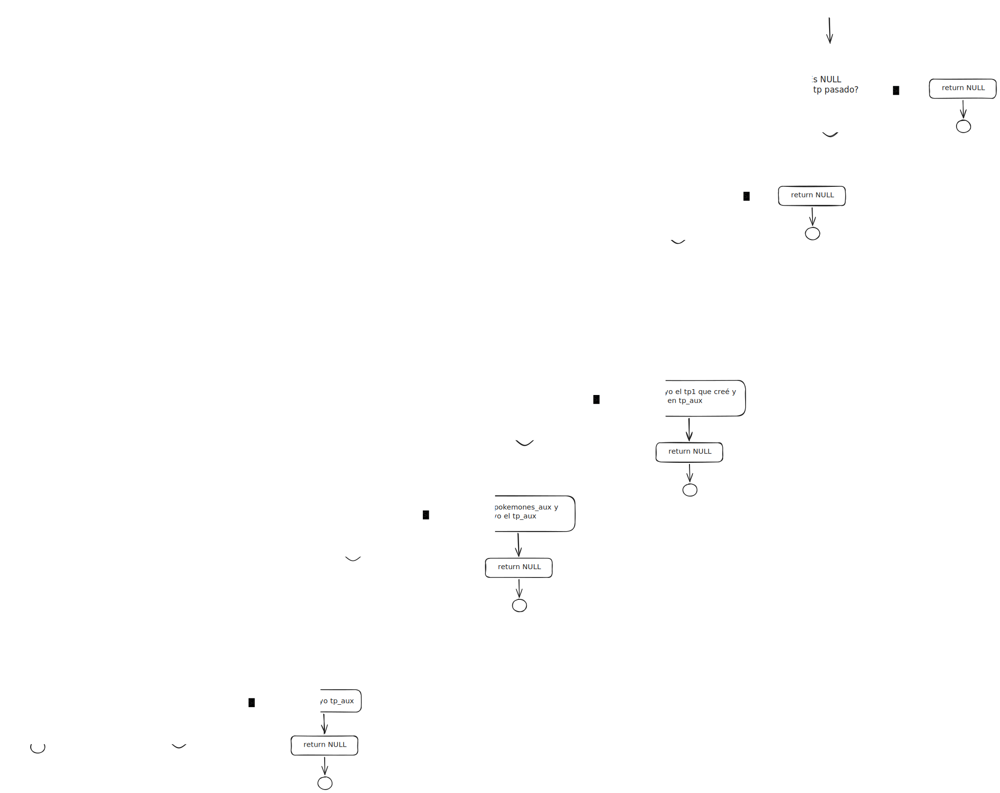
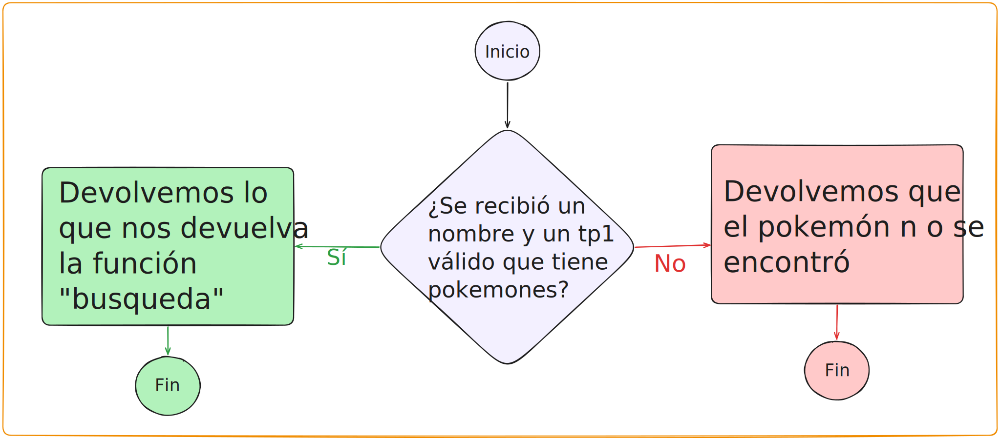
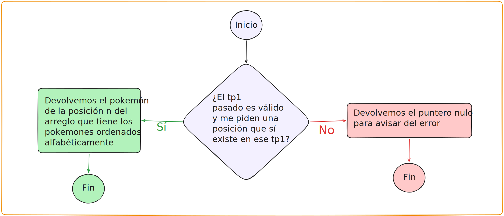
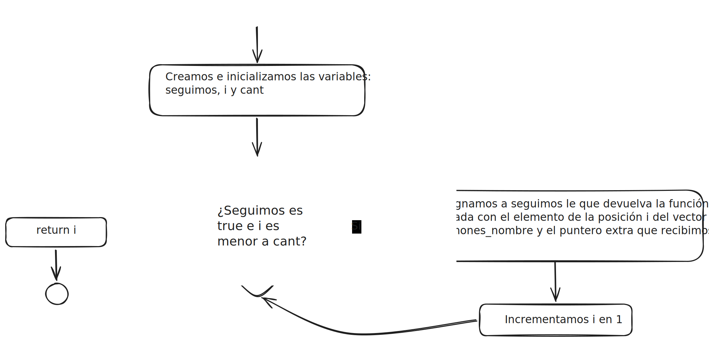
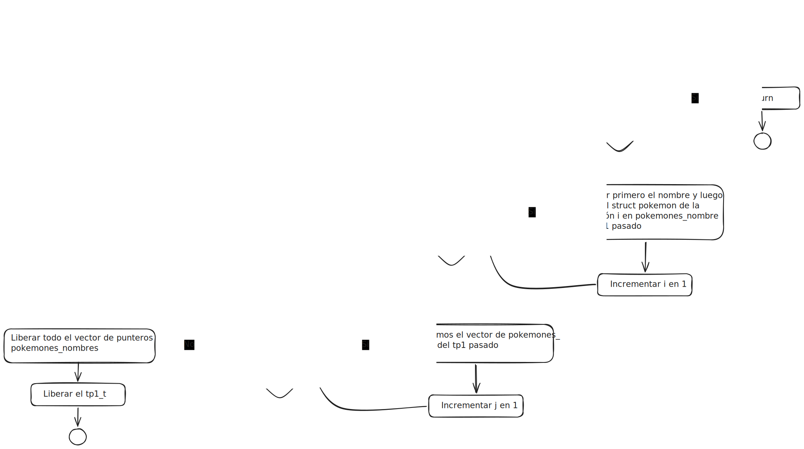
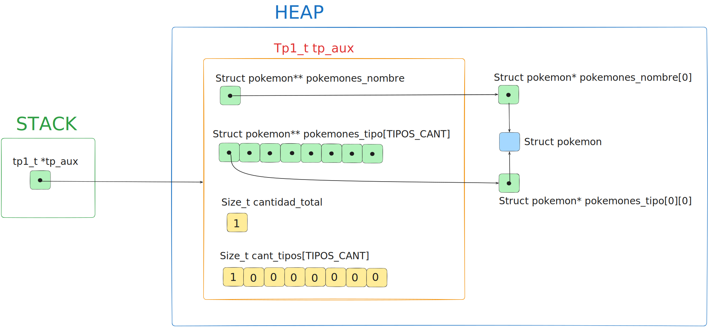

<div align="right">
    
</div>

# TP


## Información del estudiante

* Lautaro Jesús Duarte Vera
* 114088
* lautarojesussss@gmail.com

---

## Índice
* [1. Instrucciones](#1-Instrucciones)
  * [1.1. Compilar el proyecto](#11-Compilar-el-proyecto)
  * [1.2. Ejecutar las pruebas](#12-Ejecutar-las-pruebas)
  * [1.3. Ejecutar el programa con Valgrind](#13-Ejecutar-el-programa-con-Valgrind)
* [2. Funcionamiento](#2-Funcionamiento)
* [3. Estructura](#3-Estructura)
  * [3.1. Diagrama de memoria](#31-Diagrama-de-memoria)
  * [3.2. Análisis de complejidades](#32-Análisis-de-complejidades)
* [4. Decisiones de diseño y/o complejidades de implementación](#4-Decisiones-de-diseño-yo-complejidades-de-implementación)
* [5. Respuestas a las preguntas teóricas](#5-Respuestas-a-las-preguntas-teóricas)

## 1. Instrucciones

### 1.1. Compilar el proyecto
```bash
make
```

### 1.2. Ejecutar las pruebas
```bash
make run
```

### 1.3. Ejecutar el programa con Valgrind
```bash
make valgrind-main
```

## 2. Funcionamiento

El TDA `tp1_t` y sus primitivas sirven para guardar y consultar información de diferentes pokemones, después de cargar un `tp1_t` con pokemones de un archivo se puede consultar sobre un pokemon especifico dando su nombre o su posición por orden alfabético, y también se puede consultar por varios pokemones, dando el tipo que se quiere obtener. Se le puede aplicar cambios a los pokemones del tp1_t usando el iterador interno `tp1_con_cada_pokemon`, y se puede consultar la cantidad total de pokemones en un `tp1_t`.

<div align="center">
  
  <p><i>Diagrama de flujo de tp1_leer_archivo.</i></p>
</div>
<div align="center">
  
  <p><i>Diagrama de flujo tp1_cantidad.</i></p>
</div>
<div align="center">
  
  <p><i>Diagrama de flujo de tp1_guardar_archivo.</i></p>
</div>
<div align="center">
  
  <p><i>Diagrama de flujo de tp1_filtrar_tipo.</i></p>
</div>
<div align="center">
  
  <p><i>Diagrama de flujo de tp1_buscar_nombre.</i></p>
</div>
<div align="center">
  
  <p><i>Diagrama de flujo de tp1_buscar_orden.</i></p>
</div>
<div align="center">
  
  <p><i>Diagrama de flujo de tp1_con_cada_pokemon.</i></p>
</div>
<div align="center">
  
  <p><i>Diagrama de flujo de tp1_destruir.</i></p>
</div>


## 3. Estructura
Para la estructura `tp1_t` se decidió utilizar un arreglo de punteros a `struct pokemon`, mantenido en orden alfabético (`pokemones_nombre`) junto con un arreglo de arreglos de punteros donde cada sub-arreglo almacena exclusivamente punteros a Pokémones de un tipo específico (`pokemones_tipo`). Además, se mantienen los topes respectivos de todos los arreglos.


### 3.1. Diagrama de memoria

<div align="center">
  
  <p><i>Diagrama de memoria del TDA tp1_t, en el caso de que tuviese cargado solamente un pokemon de tipo ELEC.</i></p>
</div>


### 3.2. Análisis de complejidades temporales
Los siguientes analisis de complejidad temporal asintótica se realizan bajo la premisa de que el tamaño del problema, N ,representa siempre la cantidad de pokemones involucrados, ya sea en un archivo de entrada, dentro de la estructura `tp1_t`, o en un arreglo dinámico de punteros.

El analisis de la complejidad de la función `tp1_leer_archivo` se detalla fuera de la siguiente tabla, debido a que requiere un desglose mucho más exhaustivo en comparación con el resto de las funciones que se analizan en esta sección. 

|      Función      |Complejidad|                 Justificación                  |
|:-----------------:|:---------:|:----------------------------------------------:|
| `tp1_cantidad`       |  $O(1)$   |Independientemente de la cantidad de punteros que tengan los arreglos del `tp1_t` sacar la cantidad total es simplemente consultar el campo size_t `cantidad_total` y nada más, es decir, es de complejidad temporal asintótica constante.|
|      `tp1_buscar_orden`       |  $O(1)$   |No importa qué posición tenga el pokemon solicitado, en todos los casos hago un acceso directo a esa posición y devuelvo el valor, la complejidad temporal asintótica es constante.|
|      `tp1_destruir`       |  $O(n)$ |La complejidad temporal asintótica es lineal porque debo se recorre el arreglo, que tiene a todos los pokemones, y se los libera (liberarlos implica dos operaciones únicamente), luego a parte a parte se liberan los arreglos exclusivos de cada tipo, y eso es constante porque son siempre 8 operaciones, dado que `CANT_TIPO` vale 8.|
| `tp1_con_cada_pokemon`       |  $O(n)$   |Hago una iteración sobre el arreglo pokemones_nombre que tiene todos los pokemones, así que en el peor de los casos es justo n la cantidad de operaciones y eso se multiplica por la complejidad temporal asintótica de f, que no conozco, por ende O(n.O(f)).|
| `tp1_guardar_archivo`       |  $O(n)$   |Es un caso de uso particular para el iterador interno, que como vimos es lineal, y la función que se le aplica a cada pokemon es de escritura, es decir, de complejidad temporal asintótica constante en relación a la cantidad de pokemones, por lo tanto `tp1_t tp1_guardar_archivo` es de complejidad temporal asintótica lineal.|
| `tp1_buscar_nombre`       |  $O(log(n))$   |El algortimo que se usa para encontrar el pokemon solicitado dentro del arreglo de `pokemones_nombre` es la búsqueda binaria. La búsqueda binaria es un algortimo de divide y vencerás al que se le puede aplicar el teorema maestro, la función tiene una sola llamada recursiva por ende las llamadas no crecen a medida que se "profundiza" en los niveles del árbol de recursión, es decir, el factor de ramificación es 1, y la parte no recursiva es constante (calcular una posición y contrastar un valor con otro), por ende en todos los niveles el trabajo no solo es igual sino que es de complejidad temporal asintótica constante, y la complejidad temporal asintótica del total de la función se puede calcular con la cantidad de niveles, que se calcula con el $\log_b n$, siendo b el factor de reducción y n el tamaño del problema, ello nos da una complejidad temporal asintótica logarítmica.|
| `tp1_filtrar_tipo`       |  $O(n)$   |En esta función se realizan copias de los pokemones del arreglo exclusivo del tipo solicitado, que siempre es menor o igual al arreglo que contiene a todos los pokemones, en el peor de los casos (que justo todos los pokemones del `tp1_t` sean del tipo solicitado) la complejidad temporal asintótica es 2n, o sea, la complejidad temporal asintótica es lineal.|


#### Analisis de la complejidad de `tp1_leer_archivo`:
  Esta es la función más compleja y larga de las que se pedía implementar, por eso hago el analisis por separado, fuera de la tabla. En el peor de los casos se realizan 4 llamadas a funciones auxiliares de complejidad temporal asintótica no constante, estas son `cargar_en_bruto`, `ordenar_alfabeticamente`, `limpiar_y_contar`, y `clasificar_por_tipo`.
Prosigo con el analisis de cada una para determinar la complejidad total de la función. 

##### Analis de la complejidad de `cargar_en_bruto`:

La función ejecuta un ciclo `while` que itera $N$ veces (una vez por cada línea/Pokémon leída del archivo). En cada iteración, insertar un elemento en un arreglo, lo que implica $1$ operación. Sin embargo, cuando la capacidad del arreglo se llena, la función `agregar_pokemon` realiza un `realloc` duplicando el tamaño del buffer y copiando los elementos existentes.

Dado que las redimensiones del arreglo ocurren en potencias de 2 ($2, 4, 8, 16...$), la cantidad total de redimensiones para $N$ pokemones es $\log_2 N$. 

Aplicando el análisis de la complejidad amortizada, el costo total de todas las copias de memoria en está dado por la siguiente sumatoria:

$$\Large \text{Costo de Copias} = \sum_{i=1}^{\log_2 N} 2^i$$

Por la propiedad matemática de la suma de potencias de 2, sabemos que $\Large \sum_{i=1}^{k} 2^i = 2^{k+1} - 2$. Reemplazando obtenemos:

$$\Large \text{Costo de Copias} = 2^{(\log_2 N) + 1} - 2$$

Aplicando la propiedades de exponentes pasamos a tener ($x^{a+1} = x \cdot x^a$):

$$\Large \text{Costo de Copias} = 2 \cdot 2^{\log_2 N} - 2$$

Y por propiedades de logaritmos, sabemos que $2^{\log_2 N} = N$. Por lo tanto, la expresión queda como:

$$\Large \text{Costo de Copias} = 2N - 2$$

Para obtener el esfuerzo exacto $f(N)$ en el peor de los casos, sumamos el costo de las inserciones individuales ($N$) al costo total de las copias que acabamos de calcular y al costo de leer y parsear las lineas

$$\Large f(N) = N + (2N - 2) +2N = 5N - 2$$

Por las propiedades del análisis asintótico, sabemos que los coeficientes y los términos de menor grado no afectan la tasa de crecimiento cuando $N$ tiende a infinito. Por lo tanto, podemos afirmar que la función tiene una complejidad temporal asintótica lineal.

##### Analisis de la función `ordenar_alfabeticamente`:

La función `ordenar_alfabeticamente` actúa como punto de entrada para `merge_sort_alfabetico`, el cual implementa un algoritmo del tipo *divide y vencerás*. 

Podemos modelar su complejidad temporal $T(N)$ para un arreglo de $N$ Pokémones mediante la siguiente relación de recurrencia:

$$\Large T(N) = 2T(N/2) + O(N)$$ 

Donde:
* El término $2T(N/2)$ representa las dos llamadas recursivas, cada una procesando la mitad del arreglo.
* El término $O(N)$ representa el costo lineal de la función `merge_alfabetico`, la cual recorre y mezcla las dos mitades en un arreglo ordenado auxiliar.

Para resolver esta recurrencia, aplicamos el **Teorema Maestro**, cuya forma general es:

$$\Large T(N) = aT(N/b) + f(N)$$

Extrayendo las constantes de nuestra función, obtenemos:
* $a = 2$ (factor de ramificación)
* $b = 2$ (factor de reducción)
* $f(N) = O(N)$ (esfuerzo de mezcla)

Para determinar en qué caso del teorema nos encontramos, calculamos el polinomio crítico $N^{\log_b a}$ que representa la cantida de hojas del árbol:

$$\Large N^{\log_2 2} = N^1 = N$$

Al comparar el esfuerzo de mezcla $f(N)$ con el polinomio crítico que representa la cantidad de hojas, observamos que crecen asintóticamente a la misma velocidad (es decir, $f(N)$ es proporcional a $N^{\log_b a}$). Esto significa que estamos en el **Caso 2** del Teorema Maestro.

La resolución para el Caso 2 dicta que la complejidad temporal final se obtiene multiplicando el polinomio crítico (o el esfuerzo de mezcla, porque son equivalentes) por un factor logarítmico:

$$\Large T(N) = O(N^{\log_b a} \log_2 N)$$

Sustituyendo en nuestros valores:

$$\Large T(N) = O(N \log_2 N)$$

Aplicando el Teorema Maestro, se demostró que la complejidad temporal asintótica de `ordenar_alfabeticamente` en el peor de los casos pertenece a **$O(N \log N)$**.

#### Análisis de la función `limpiar_y_contar`

La función `limpiar_y_contar` tiene como objetivo eliminar los Pokémones duplicados y contar la distribución por tipos. Su algoritmo utiliza una técnica de "dos punteros" (`i` y `j`) para recorrer y modificar el arreglo sin utilizar arreglos auxiliares.

Para un arreglo de $N$ Pokémones, podemos dividir el análisis en dos etapas:

1. **Recorrido y limpieza:** El ciclo `while` itera a lo sumo $N$ veces. En cada iteración, realiza operaciones de reasignación de punteros, incrementos aritméticos y libera memoria (`free`), las cuales son todas $\mathcal{O}(1)$. Además, ejecuta `strcasecmp` para comparar nombres. Dado que la longitud máxima de un nombre es una constante acotada ($L$), la comparación se considera $\mathcal{O}(1)$. El costo total de este ciclo es $\mathcal{O}(N)$.
2. **Ajuste de memoria:** Al finalizar, se llama a `ajustar_buffer` (que ejecuta un `realloc`) para encoger el arreglo y liberar la memoria sobrante. En el peor de los casos, si no hubo duplicados, se copian $N$ punteros, lo que implica un esfuerzo de $\mathcal{O}(N)$.

Aplicando la regla de la suma para bloques secuenciales, la función de costo asintótico resulta:

$$\Large T(N) = \mathcal{O}(N) + \mathcal{O}(N) \in \mathcal{O}(N)$$

**Conclusión:** La complejidad temporal asintótica de `limpiar_y_contar` es estrictamente **$\mathcal{O}(N)$**.

---

#### Análisis de la función `clasificar_por_tipo`

La función `clasificar_por_tipo` distribuye los punteros de los Pokémones ya procesados en 8 arreglos secundarios según su tipo.

El algoritmo consta de dos bloques secuenciales:

1. **Reserva de Memoria:** Un bucle `for` inicial reserva la memoria exacta necesaria para cada arreglo de tipos. Como la cantidad de tipos es constante (`CANT_TIPOS = 8`) y los tamaños exactos ya fueron calculados en la función `limpiar_y_contar` (evitando tener que redimensionar los arreglos dinámicamente), este ciclo se ejecuta en tiempo constante $\mathcal{O}(1)$.
2. **Distribución de Punteros:** El segundo ciclo `for` itera exactamente $N$ veces (donde $N$ es la cantidad de Pokémones únicos restantes). En cada iteración, realiza lecturas y asignaciones de punteros mediante índices en los diferentes arreglos. El acceso directo a un arreglo en memoria tiene costo $\mathcal{O}(1)$. El esfuerzo total de este ciclo es $\mathcal{O}(N)$.

Planteando la suma de complejidades secuenciales, el término constante es absorbido por el término lineal:

$$\Large T(N) = \mathcal{O}(1) + \mathcal{O}(N) \in \mathcal{O}(N)$$

**Conclusión:** Gracias a la pre-asignación de memoria exacta, la complejidad temporal asintótica de `clasificar_por_tipo` es **$\mathcal{O}(N)$**.
 
#### Conclusión final
Dado que estas funciones se ejecutan de manera estrictamente secuencial una tras otra, el esfuerzo temporal total $T(N)$ de `tp1_leer_archivo` se representa como la suma de los esfuerzos asintóticos de sus componentes:

$$\Large T(N) = O(N) + O(N \log N) + O(N) + O(N)$$

Para simplificar esta expresión, aplicamos la Regla del Término Dominante del análisis asintótico, la cual establece que la suma de varias complejidades temporales pertenece al orden de la función con mayor tasa de crecimiento. Al comparar nuestras cotas, sabemos que el crecimiento lineal-logarítmico domina de forma estricta al crecimiento lineal cuando $N$ tiende a infinito ($N \log N > N$). Por lo tanto, los términos lineales de `cargar_en_bruto`, `limpiar_y_contar` y `clasificar_por_tipo` son absorbidos por el término dominante del ordenamiento:

$$\Large T(N) \in O(N \log N)$$

**Conclusión:** La complejidad temporal asintótica total de la función `tp1_leer_archivo` está dictada por su operación más costosa, resultando en un tiempo de ejecución de **$O(N \log N)$**.


## 4. Decisiones de diseño y/o complejidades de implementación
Se estableció que la mayor parte del procesamiento ocurra en la función `tp1_leer_archivo`, que tiene complejidad temporal asintótica $O(N)$, esta función se encarga de leer el archivo, validar las lineas, crear y cargar los struct pokemon, ordenarlos por orden alfabético, quitar los repetidos, contar los pokemones por tipo y finalmente ordenar a los pokemones por su tipo.

Para la carga en bruto de los punteros se utilizó una estrategia de expansión geométrica (complejidad amortizada), evitando así que la función principal recaiga en una complejidad temporal asintótica $O(N^2)$ por los `reallocs` excesivos, y para el orden alfabético se implementó una versión de merge sort con `strcasecmp` para la comparación de elementos; luego se ejecutan dos iteraciones distintas en arreglo que tiene a todos los pokemones, una para quitar los pokemones repetidos del arreglo y contabilizar los únicos en función de su tipo, y otra para colocar copias de los punteros en los arreglos que están dedicados a un solo tipo de pokemones.

En la función `tp1_buscar_nombre` se implementó una búsqueda binaria para hacer que la complejidad temporal asintótica de la función no fuese lineal sino logarítmica, aprovechando que en `tp1_leer_archivo` se ordenó alfabéticamente los pokemones.

Para `tp1_filtrar_tipo` se recorre únicamente el arreglo exclusivo del tipo solicitado de los pokemones del `tp1_t` fuente, y se copia la información al arreglo `pokemones_nombre` y al arreglo exclusivo del tipo solicitado del `tp1_t` destino, por último se actualiza el campo `cantidad_total` y el valor que representa la cantidad del tipo solicitado dentro del arreglo de cantidades del `tp1_t` destino.

Se decidió modularizar algunas funciones de la implementación colocándolas en `utils.h` debido a que estas funciones no están relacionadas estrictamente con el TDA `tp1_t` del trabajo práctico y/o se necesitaban en el main.c

## 5. Respuestas a las preguntas teóricas

1) "Explicar la elección de la estructura para implementar la funcionalida pedida. Justifique el uso de cada uno de los campos de la estructura." Esto se explica en la sección 3, Estructura.

2) "Dar una definición de complejidad computacional y explique cómo se calcula."
La complejidad computacional es...

3) "Explicar con diagramas cómo quedan dispuestas las estructuras y elementos en memoria." Esto también se explica en la sección 3, Estructura.

4) "Justificar la complejidad computacional temporal de cada una de las funciones que se piden implementar." Esto se justifica en la sección 3.2, Analisis de complejidades.

5) "Explique qué dificultades tuvo para implementar las funcionalidades pedidas en el main (si tuvo alguna) y explique si alguna de estas dificultades se podría haber evitado modificando la definición del .h" 
Esto se responde en la sección 4 del informe.
