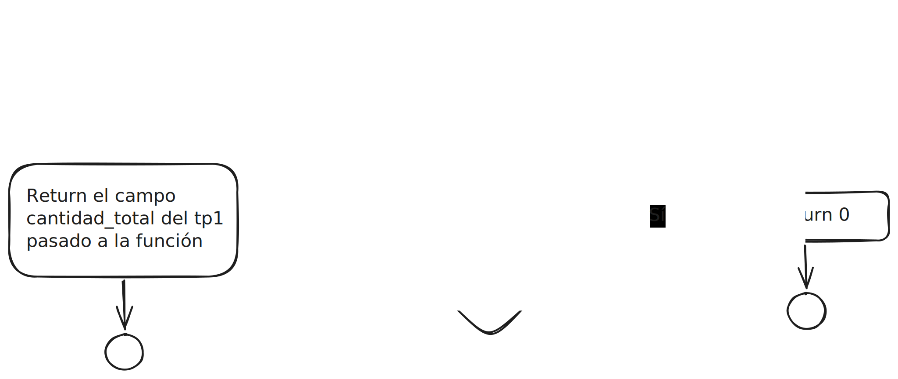
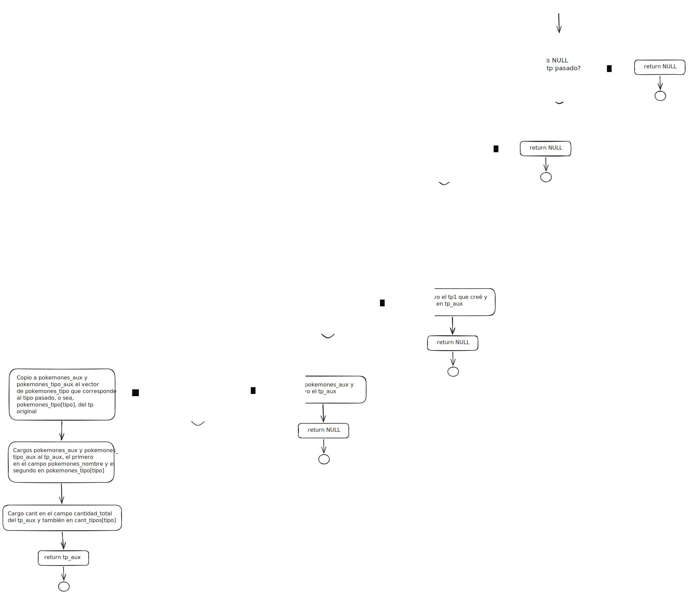
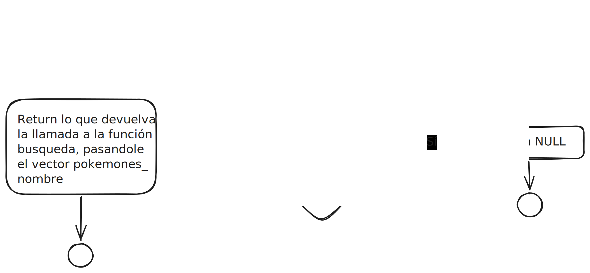
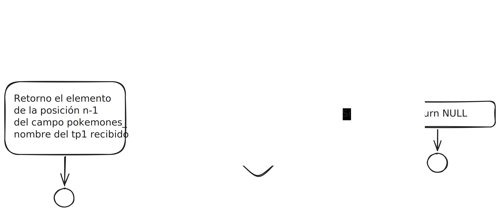
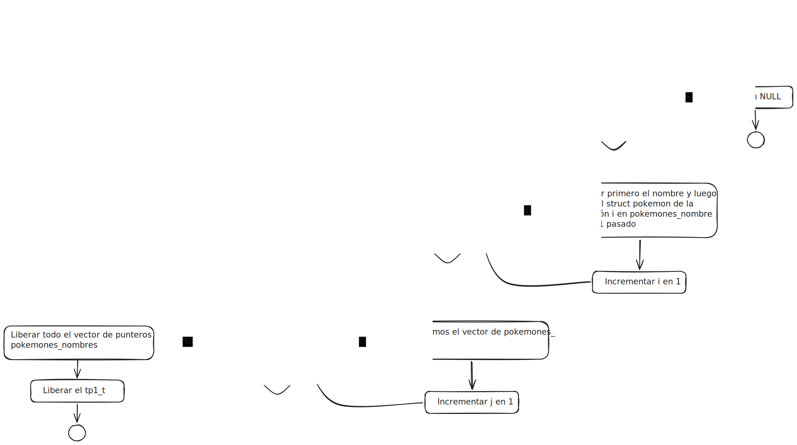
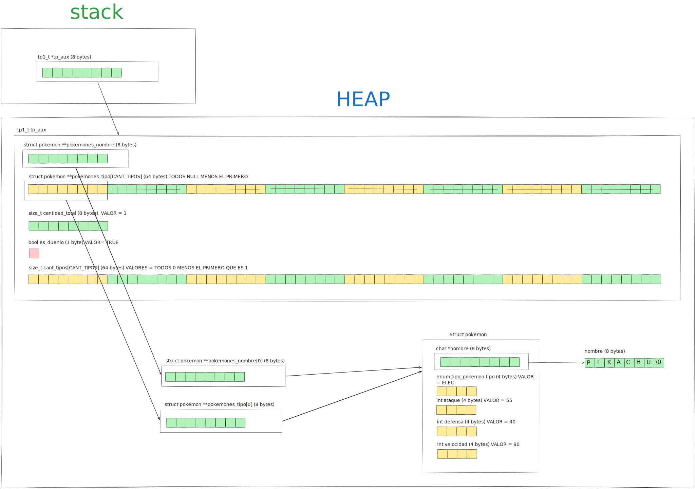

<div align="right">
    
</div>

# TP


## Información del estudiante

* Lautaro Jesús Duarte Vera
* 114088
* lautarojesussss@gmail.com

---

## Índice
* [1. Instrucciones](#1-Instrucciones)
  * [1.1. Compilar el proyecto](#11-Compilar-el-proyecto)
  * [1.2. Ejecutar las pruebas](#12-Ejecutar-las-pruebas)
  * [1.3. Ejecutar el programa con Valgrind](#13-Ejecutar-el-programa-con-Valgrind)
* [2. Funcionamiento](#2-Funcionamiento)
* [3. Estructura](#3-Estructura)
  * [3.1. Diagrama de memoria](#31-Diagrama-de-memoria)
  * [3.2. Análisis de complejidades](#32-Análisis-de-complejidades)
* [4. Decisiones de diseño y/o complejidades de implementación](#4-Decisiones-de-diseño-yo-complejidades-de-implementación)
* [5. Respuestas a las preguntas teóricas](#5-Respuestas-a-las-preguntas-teóricas)

## 1. Instrucciones

### 1.1. Compilar el proyecto
```bash
make
```

### 1.2. Ejecutar las pruebas
```bash
make run
```

### 1.3. Ejecutar el programa con Valgrind
```bash
make valgrind-main
```

## 2. Funcionamiento

El tp1_t y sus primitivas funciona para guardar y consultar información de diferentes pokemones, después de cargar un tp1 con pokemones de un archivo se puede consultar sobre un pokemon dando su nombre o su posición por orden alfabético, y también consultar por varios pokemones dando el tipo que se quiere obtener; se le puede aplicar cambios a los pokemones del tp1_t usando el iterador interno tp1_con_cada_pokemon, y se puede consultar la cantidad total de pokemones en un tp1.

<div align="center">
  
  <p>Diagrama de memoria de la estructura.</p>
</div>
<div align="center">
  
  <p>Diagrama de memoria de la estructura.</p>
</div>
<div align="center">
  
  <p>Diagrama de memoria de la estructura.</p>
</div>
<div align="center">
  
  <p>Diagrama de memoria de la estructura.</p>
</div>
<div align="center">
  
  <p>Diagrama de memoria de la estructura.</p>
</div>
<div align="center">
  
  <p>Diagrama de memoria de la estructura.</p>
</div>
<div align="center">
  
  <p>Diagrama de memoria de la estructura.</p>
</div>
<div align="center">
  
  <p>Diagrama de memoria de la estructura.</p>
</div>


## 3. Estructura
Para eso decidí usar un vector de punteros a struct pokemon que los tenga ordenados por orden alfabético y un arreglo de arreglos de punteros que tengan cada uno solo a los de un tipo (ELEC, FUEG, NORM etc etc) y tengo los respectivos topes de todos los vectores y una variable booleana para saber si al destruir un tp1_t debo liberar también a los pokemones o solamente los punteros que este tp1_t tenía a ellos.


### 3.1. Diagrama de memoria

<div align="center">
  
  <p>Diagrama de memoria de la estructura.</p>
</div>


### 3.2. Análisis de complejidades
Explicar las complejidades de las diversas funciones que se implementaron en el programa. Esto debe incluir al menos a las funciones de la interfaz (el .h) del programa. Además, se debe ofrecer una justificación de la complejidad, es decir, por qué es esa la complejidad Big-O y no otra.

### 3.2. Análisis de complejidades (EJEMPLO 1)
En el programa tenemos funciones auxiliares y funciones principales (las que van en el .h). Respecto a estas funciones podemos analizar que:
* `fun1` tiene una complejidad de $O(1)$ ya que tiene como parámetro... y, al leer una línea....
* `fun2` tiene una complejidad de $O(n)$ ya que tiene como parámetro..., la cual....
* `fun3` tiene una complejidad de $O(n^2)$ ya que tiene como parámetro... y se encarga de....

### 3.2. Análisis de complejidades (EJEMPLO 2)
|      Función      |Complejidad|                 Justificación                  |
|:-----------------:|:---------:|:----------------------------------------------:|
|      `fun1`       |  $O(1)$   |Tiene como parámetro... y, al leer una línea....|
|      `fun2`       |  $O(n)$   |Tiene como parámetro..., la cual....            |
|      `fun3`       |  $O(n^2)$ |Tiene como parámetro... y se encarga de....     |

## 4. Decisiones de diseño y/o complejidades de implementación
Decidí que el grueso del trabajo ocurra en la función tp1_leer_archivo, que tiene complejidad asintotica O(nlog(n)) ahí me encargo de leer los archivos, validar las lineas, crear y cargar los struct pokemon, ordenarlos por orden alfabético, quitar los repetidos, contar los pokemones por tipo y finalmente ordenar a los pokemones por su tipo, así puedo hacer que las funciones de consultas al tp1_t y de filtrado tengan una complejidad asintotica constante o dependiente de la cantidad de pokemones del tipo en cuestión que se pretende filtrar y no de la cantidad de todos los pokemones.

Para la carga en bruto de los punteros a los pokemones use complejidad amortizada, así evitaba que tp1_leer_archivo fuese O(n cuadarado) por los reallocs, y para el orden alfabético uso merge sort y strcasecmp; luego hago dos iteraciones distintas , una para ir quitando los repetidos y contabilizar los únicos en función de su tipo, y otra para ir acomodando copias de los punteros en los arreglos que están dedicados a un solo tipo de pokemones, podría haberlo hecho con una sola iteración esas cosas pero ví que quedaba demasiado confuso el código, y como al final agregar otra iteración no aumenta la complejidad asíntotica de la función decidí separarlo en dos iteraciones diferentes.

En la función tp1_buscar_nombre utilice busqueda binaria para hacer que la complejidad asintotica de la función no fuese lineal sino logaritmica, aprovechando que tengo el vector pokemones_nombre que los tiene ordenados alfabéticamente.

Para tp1_filtrar_tipo aprovecho que tengo los arreglados exclusivos de cada tipo y directamente me encargo de copiar la información del tipo en cuestión en un nuevo tp1, especificamente copio la info del vector exclusivo con el tipo solicitado y lo pongo tanto en el vector pokemones_nombre como en el vector exclusivo del tipo solicitado, y cambió los campos que representan los topes, el resto ya viene inicializados en cero, y en el caso de los punteros en NULL, así que los dejo como estaban. De esta manera evito que la complejidad asintotica de la función sea lineal, salvo que justo los n pokemones del tp1 sean todos del tipo solicitado.

## 5. Respuestas a las preguntas teóricas
Deberás incluir en esta sección las respuestas a las preguntas teóricas indicadas en el [enunciado](./ENUNCIADO.md) del TP.

## 5. Respuestas a las preguntas teóricas (EJEMPLO)

### 5.1. ¿Porqué...?
Respondido en su respectiva sección.

### 5.2 ¿Cómo...?
Para implementar el....

### 5.3 ¿Cuál fue el...?
El motivo fue....
